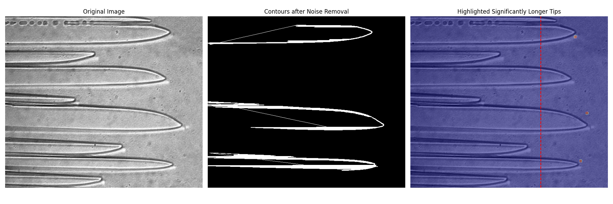

# AgarDetection

A computer vision toolkit for real-time game element detection in Agar.io using Python and OpenCV.

## Overview

AgarDetection is a Python-based computer vision project that uses edge detection, bilateral filtering, and image processing techniques to detect and analyze game elements in Agar.io. The toolkit captures screen content in real-time and applies various image processing algorithms to identify cells, food pellets, viruses, and other game objects.

## Features

- **Real-time Screen Capture** – Captures game window content for processing
- **Edge Detection** – Identifies object boundaries using Canny edge detection
- **Bilateral Filtering** – Smooths images while preserving edge sharpness
- **Color-based Detection** – Detects game elements based on color profiles
- **Video Processing** – Processes video streams frame-by-frame

## Project Structure

```
AgarDetection/
├── VideoEdge.py              # Edge detection on video/screen capture
├── RefineEdge.py             # Enhanced edge detection with refinement
├── bilateral.py              # Bilateral filter implementation for images
├── bilateralVideo.py         # Bilateral filtering on video streams
├── ColorTest.py              # Color-based detection testing
├── test.py                   # Testing and experimentation script
├── windowTitles              # Configuration for window capture targets
└── highlighted_tips_with_feedback.png  # Sample output visualization
```

## Requirements

- Python 3.7+
- OpenCV (`cv2`)
- NumPy
- MSS (for screen capture)
- PyAutoGUI (optional, for automation)

## Installation

1. **Clone the repository:**
   ```bash
   git clone https://github.com/Chhumbucket/AgarDetection.git
   cd AgarDetection
   ```

2. **Install dependencies:**
   ```bash
   pip install opencv-python numpy mss pyautogui
   ```

## Usage

### Edge Detection on Video

Run edge detection on a live screen capture or video file:

```bash
python VideoEdge.py
```

### Bilateral Filtering

Apply bilateral filtering to smooth images while preserving edges:

```bash
python bilateral.py
```

For video streams:

```bash
python bilateralVideo.py
```

### Color Detection Testing

Test color-based detection algorithms:

```bash
python ColorTest.py
```

### Refined Edge Detection

Run enhanced edge detection with noise reduction:

```bash
python RefineEdge.py
```

## How It Works

### Edge Detection Pipeline

1. **Capture** – Screen content is captured using MSS for high-performance screenshots
2. **Preprocessing** – Images are converted to grayscale and noise is reduced
3. **Edge Detection** – Canny edge detector identifies object boundaries
4. **Refinement** – Morphological operations clean up detected edges

### Bilateral Filtering

Bilateral filtering is used to smooth the image while keeping edges sharp:
- Reduces noise from compression artifacts
- Preserves cell boundaries for accurate detection
- Improves color segmentation accuracy

### Color Detection

Game elements are identified by their distinctive colors:
- **Cells** – Various colors based on player/enemy
- **Food Pellets** – Small colored dots
- **Viruses** – Green spiky objects
- **Ejected Mass** – Small colored blobs

## Configuration

Edit `windowTitles` to specify which window to capture:

```
Agar.io
agar.io - Google Chrome
```

## Example Output

The project generates visualizations showing detected elements:



## Contributing

Contributions are welcome! Feel free to:

1. Fork the repository
2. Create a feature branch (`git checkout -b feature/improvement`)
3. Commit your changes (`git commit -am 'Add new feature'`)
4. Push to the branch (`git push origin feature/improvement`)
5. Open a Pull Request

## Potential Improvements

- [ ] Machine learning-based object detection (YOLO/SSD)
- [ ] Player tracking and trajectory prediction
- [ ] Automated gameplay strategies
- [ ] Support for additional browser games
- [ ] Performance optimization for higher FPS

## Disclaimer

This project is intended for educational purposes only. Use responsibly and in accordance with the game's terms of service. The authors are not responsible for any misuse of this software.

## License

This project is open source. See the repository for license details.

## Acknowledgments

- OpenCV community for computer vision tools
- MSS library for efficient screen capture
- Agar.io for the inspiration

---

**Note:** This project is a work in progress. Some features may be experimental or under development.
